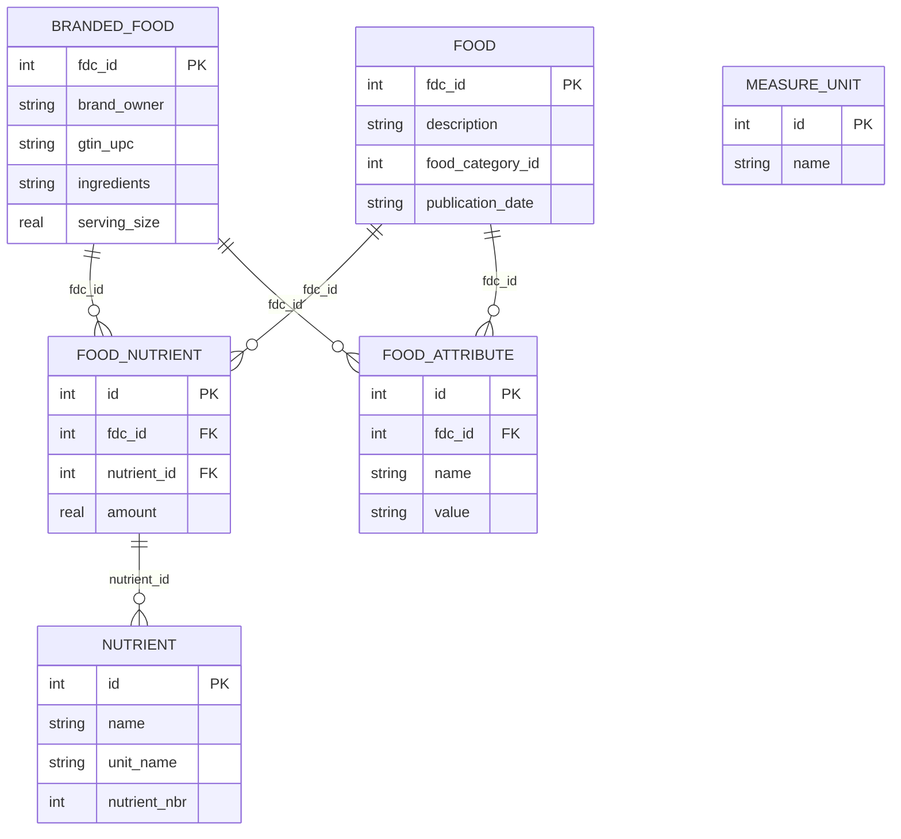

# Food Database Schema and Relationships

## Database Overview

This database is built from several CSV files containing information about branded foods, nutrients, attributes, and more. It represents a collection of interconnected tables that allow for detailed queries about food products, their nutritional content, and various attributes.

## Tables and Relationships

### 1. branded_food

Description: Contains branded food data including brand owners, product details, and ingredients.

- Primary Key: `fdc_id`
- Relevant Columns:
  - `fdc_id`: Unique identifier for each food item.
  - `brand_owner`: Name of the brand or company that owns the food product.
  - `gtin_upc`: The product's Global Trade Item Number (GTIN) or Universal Product Code (UPC).
  - `ingredients`: List of ingredients in the product.
  - `serving_size`: Size of a serving in terms of measurement units.
  - `market_country`: The country where the product is available.
  - `discontinued_date`: Date when the product was discontinued (if applicable).

#### Relationships for branded_food

- Linked to the `food_nutrient` table by `fdc_id`, which allows for the retrieval of nutrient information for each branded food.
- Linked to `food_attribute` by `fdc_id`, which can provide additional attributes for the branded food.

### 2. food

Description: Contains information about general food items (not necessarily branded).

- Primary Key: `fdc_id`
- Relevant Columns:
  - `fdc_id`: Unique identifier for each food item.
  - `description`: Description of the food item.
  - `food_category_id`: ID representing the category of the food.
  - `publication_date`: The date when the food data was published.
  - `market_country`: The country in which the food is available.

#### Relationships for food

- Linked to the `food_nutrient` table by `fdc_id`, which allows for nutrient data to be accessed for each food.
- Linked to the `food_attribute` table by `fdc_id` for detailed food attributes (e.g., nutrient updates, ingredient info).

### 3. food_attribute

Description: Stores additional attributes related to food items (e.g., ingredient details, changes to nutrients).

- Primary Key: `id`
- Relevant Columns:
  - `fdc_id`: The unique identifier linking the attribute to a food item.
  - `name`: The name of the attribute (e.g., "Nutrient Updated").
  - `value`: The value of the attribute (numeric or text).
  - `food_attribute_type_id`: The type of attribute.

#### Relationships for food_attribute

- Linked to the `food` table by `fdc_id`, providing details about specific attributes of foods.
- Linked to the `branded_food` table by `fdc_id`, offering additional attributes for branded food items.

### 4. food_nutrient

Description: Contains nutrient data for foods, representing the amounts of specific nutrients present in each food item.

- Primary Key: `id`
- Relevant Columns:
  - `fdc_id`: Unique identifier of the food item the nutrient belongs to.
  - `nutrient_id`: ID of the nutrient.
  - `amount`: The amount of the nutrient in the food item.

#### Relationships for food_nutrient

- Linked to the `food` table by `fdc_id` to provide nutrient information for general food items.
- Linked to the `branded_food` table by `fdc_id` to provide nutrient information for branded foods.
- Linked to the `nutrient` table by `nutrient_id` to map nutrient details.

### 5. nutrient

Description: Represents various nutrients (e.g., protein, fat, vitamins) and their associated details.

- Primary Key: `id`
- Relevant Columns:
  - `id`: Unique identifier for each nutrient.
  - `name`: The name of the nutrient (e.g., "Protein").
  - `unit_name`: Unit of measurement for the nutrient (e.g., grams, KCAL).
  - `nutrient_nbr`: A numeric code associated with the nutrient.

#### Relationships for nutrient

- Linked to the `food_nutrient` table by `nutrient_id` to map nutrients to food items.
- Provides detailed nutrient descriptions for the data in `food_nutrient`.

### 6. measure_unit

Description: Stores information about measurement units (e.g., cups, grams).

- Primary Key: `id`
- Relevant Columns:
  - `id`: Unique identifier for each unit.
  - `name`: Name of the unit (e.g., "cup", "tablespoon").

#### Relationships for measure_unit

- Although no direct foreign key connections to other tables are shown, this table provides measurement unit details that could be used for food portion sizes or nutrient amounts.

## Schema Relationships (Visual Overview)

## Key Points About the Schema

- `fdc_id` is a crucial foreign key that ties together tables like `branded_food`, `food`, `food_nutrient`, and `food_attribute`. It acts as the unique identifier across most tables.
- `nutrient_id` links the `food_nutrient` table to the `nutrient` table, allowing access to detailed nutrient information.
- The `measure_unit` table holds units of measurement, which could be useful for interpreting data in the `food_nutrient` or `branded_food` tables.
- Many-to-One Relationships: Each food or branded food can have multiple nutrients, attributes, or related measurements.

## Example Use Cases

- Query Nutrients for Branded Foods: You can join `branded_food`, `food_nutrient`, and `nutrient` to get detailed nutrient information for branded food products.
- Find Attributes for Specific Foods: By linking `food` with `food_attribute`, you can retrieve special attributes such as ingredient updates or labeling information.

This Markdown file provides a detailed explanation of how all the tables in your database are interconnected, making it easier to understand and query the data.

Let me know if you'd like further clarification or additional queries!
